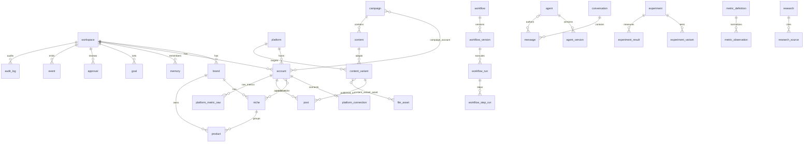

# Database architecture

Cloudflare D1 (SQLite). All schema changes are wrangler migrations in
`migrations/`, applied in filename order. Migration files are immutable once
applied to any environment that matters; new changes are new files.

```sh
npm run db:migrate:local   # apply migrations to local dev D1
npm run db:seed            # idempotent dev seed (one workspace + reference data)
npm run db:test            # fresh-DB migration + constraint test suite
npm run db:migrate:remote  # production (after setting a real database_id)
```

## Conventions

- **IDs**: TEXT UUIDs generated application-side (`crypto.randomUUID()`).
  One strategy everywhere: no integer rowids as public ids, no mixed formats.
  UUIDs are cheap in Workers, merge-safe across environments, and never leak
  record counts.
- **Time**: all timestamps are ISO-8601 UTC strings set application-side
  (`nowIso()`). No local display time is ever stored. Timezone conversion is
  a presentation concern; scheduling compares UTC instants.
- **Soft deletion**: business entities carry `deleted_at`. Historical tables
  (workflow runs, metric observations, events, audit) are never deleted at
  all. Hard deletes are further blocked by `ON DELETE RESTRICT` on parents
  that own history.
- **JSON columns** (`*_json` in domain types) store raw JSON text, parsed at
  the point of use.

## Entity map



Not drawn: scoped references (see below) from goal, memory, research,
approval, metric_observation, experiment_variant, event and audit_log into
the business entities.

## Scoped references

Several tables point at "some entity of some type" via
`(scope_type, scope_id)` or `(subject_type, subject_id)` — goals, memory,
research, approvals, metric observations, experiment variants, events, audit.
Conversations carry an optional `(scope_type, scope_id)` too (brand, product,
account or campaign; both NULL = a general workspace conversation), so chat
can attach to business context without forcing it.

These are deliberately **not** foreign keys. The alternative — one join
table or nullable FK column per target type — multiplies tables and forces a
migration every time a new scopeable entity appears. The tradeoff: referential
integrity for these links is enforced in the repository layer, and the
`event`/`audit_log` records provide traceability when a target is archived.
Every scoped column pair is indexed.

## Versioning

- `agent` / `workflow` are mutable shells holding `current_version_id`.
- `agent_version` / `workflow_version` are immutable snapshots
  (`UNIQUE(parent, version)`; no `updated_at`). A version referenced by a run
  must never be edited — the repository layer rejects updates to versions
  that have runs. History is therefore never rewritten.
- `message.agent_version_id` records exactly which configuration produced a
  message; `message.provider_metadata` records provider/model per message, so
  the conversation store is provider-agnostic.

## Memory freshness

Freshness is a derived triple, not a column:

- `last_verified_at` — when the memory was last confirmed true,
- `expires_at` — hard expiry, mainly for `temporary_context`,
- `status` — `active | superseded | archived | rejected`
  (`superseded_by` points at the replacement).

A memory is fresh iff `status = 'active'` and (`expires_at` is null or in the
future). This avoids a stored freshness flag that would silently drift.

## Analytics: two lanes

1. `metric_observation` — normalized metrics (`impressions`, `saves`,
   `outbound_clicks`, …) defined in `metric_definition`. A unique index on
   `(subject, metric, granularity, observed_at, source)` makes sync jobs
   idempotent.
2. `platform_metric_raw` — platform-native metrics preserved verbatim,
   including the raw payload. Platforms do not expose the same metrics, so
   this lane is keyed by platform-native names and never feeds UI directly.

## Secrets

No API keys, OAuth tokens, or provider secrets in D1. `platform_connection`
stores only `secret_ref` (a pointer to a Workers secret / future vault key),
scopes and non-sensitive metadata. The audit log must never receive secret
values — repositories strip them before writing `previous_value`/`new_value`.

## Deletion doctrine

- UI "delete" = set `deleted_at` (soft).
- Join/link rows (`account_niche`, `campaign_account`, `content_variant_asset`)
  cascade on hard delete of their owning side.
- Parents of history (`workflow_run`, `post`, `metric_observation`, `event`,
  `audit_log`) restrict deletion. Historical rows are permanent.

## Access pattern

Routes and components never import D1. The path is:

```
route loader / UI  →  server function (src/features/*/server.ts)
                   →  repository (src/server/db/*)
                   →  client.ts (getDb, newId, nowIso, query helpers)
                   →  env.DB (D1)
```

Writes are validated with zod schemas colocated in each repository
(`createMemoryInput`, `createCampaignInput`, …), mirroring the SQL CHECK
constraints so bad payloads fail with useful errors before touching D1.
Repositories exist where the app actually reads/writes today (workspace,
memory, campaign, conversation, message, agent, event, context reads);
add more as features land, not before.
