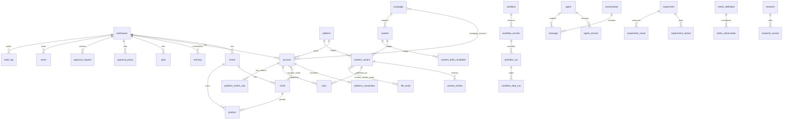

# Database architecture

Cloudflare D1 (SQLite). All schema changes are wrangler migrations in
`migrations/`, applied in filename order. Migration files are immutable once
applied to any environment that matters; new changes are new files.

```sh
npm run db:migrate:local   # apply migrations to local dev D1
npm run db:seed            # idempotent dev seed (one workspace + reference data)
npm run db:test            # fresh-DB migration + constraint test suite
npm run db:migrate:remote  # production (after setting a real database_id)
```

## Migration Index (0001–0018)

| Migration | Purpose | Key Tables / Columns |
|---|---|---|
| `0001_core_business.sql` | Core domain entities | `workspace`, `brand`, `niche`, `product`, `account`, `platform`, `platform_connection`, `account_niche` |
| `0002_agents_workflows_conversations.sql` | Agent & workflow engine base, chat | `agent`, `agent_version`, `workflow`, `workflow_version`, `workflow_run`, `workflow_step_run`, `conversation`, `message` |
| `0003_events_audit.sql` | Observability & auditing | `event`, `audit_log` |
| `0004_memory_facts_learnings.sql` | Structured memory & goals | `memory`, `goal` |
| `0005_experiments_analytics.sql` | Experimentation & metric registry | `experiment`, `experiment_variant`, `experiment_result`, `metric_definition`, `metric_observation`, `platform_metric_raw` |
| `0006_research_market_intelligence.sql` | Market intelligence storage | `research` |
| `0007_conversation_scope.sql` | Conversation scoping | `conversation.scope_type`, `conversation.scope_id` (brand, product, account, campaign) |
| `0008_approvals.sql` | Autonomy policy & requests | `approval_policy`, `approval_request` |
| `0009_workflow_engine.sql` | Engine extensions | Workflow step indexes & run plan metadata |
| `0010_content_engine.sql` | Approval policy model | Strict policy schemas, scope-based rule evaluation |
| `0011_research_sources.sql` | Sources & approvals | `research_source`, immutable approval request snapshots & SHA-256 fingerprinting |
| `0012_campaign_extensions.sql` | Campaigns & publishing | `campaign`, `campaign_account`, `content`, `content_variant`, `post`, `file_asset`, `content_variant_asset` |
| `0013_content_variants.sql` | Campaign strategy & targets | `campaign.objective`, `campaign.strategy_json`, `campaign_target`, `content_variant` enhancements |
| `0014_agent_versions.sql` | Versioning enhancements | Agent version configuration tracking |
| `0015_content_reviews.sql` | Critic review system | `content_review` (critique, suggestions, review metadata) |
| `0016_content_draft_candidate.sql` | Creator draft lifecycle | `content_draft_candidate` (uncommitted draft candidates, generated vs saved hash tracking) |
| `0017_conversation_niche_scope.sql` | Conversation niche scope | Extended `conversation.scope_type` check constraint to include `'niche'` |
| `0018_workflow_run_scope.sql` | Exact workflow run scope | `workflow_run.scope_type`, `workflow_run.scope_id`, composite index `idx_workflow_run_scope` |

## Conventions

- **IDs**: TEXT UUIDs generated application-side (`crypto.randomUUID()`).
  One strategy everywhere: no integer rowids as public ids, no mixed formats.
  UUIDs are cheap in Workers, merge-safe across environments, and never leak
  record counts.
- **Time**: all timestamps are ISO-8601 UTC strings set application-side
  (`nowIso()`). No local display time is ever stored. Timezone conversion is
  a presentation concern; scheduling compares UTC instants.
- **Soft deletion**: business entities carry `deleted_at`. Historical tables
  (workflow runs, metric observations, events, audit) are never deleted at
  all. Hard deletes are further blocked by `ON DELETE RESTRICT` on parents
  that own history.
- **JSON columns** (`*_json` in domain types) store raw JSON text, parsed at
  the point of use.

## Entity map



## Scoped references

Several tables point at "some entity of some type" via
`(scope_type, scope_id)` or `(subject_type, subject_id)` — goals, memory,
research, approvals, metric observations, experiment variants, events, audit.
Conversations carry an optional `(scope_type, scope_id)` (brand, niche, product,
account or campaign; both NULL = a general workspace conversation).

Workflow runs carry explicit, exact `(scope_type, scope_id)` (migration 0018)
with a composite index `idx_workflow_run_scope(workspace_id, scope_type, scope_id)`.
This allows precise querying of historical workflow executions per campaign or
other entity without fuzzy JSON text matching.

These are deliberately **not** foreign keys. Referential integrity for these
links is enforced in the repository layer, and the `event`/`audit_log` records
provide traceability when a target is archived.

## Canonical Metrics Registry

The `metric_definition` table (created in `0005_experiments_analytics.sql`) is the
authoritative single source of truth for all metrics in the product.

- **12 Built-in Metrics**: `revenue`, `conversions`, `orders`, `conversion_rate`,
  `qualified_visits`, `clicks`, `outbound_clicks`, `ctr`, `leads`, `saves`,
  `engagements`, `impressions` with `workspace_id IS NULL`.
- **Custom Metrics**: Workspaces may define additional custom metrics with
  `workspace_id = <workspace_uuid>`.
- **Campaign Targets**: Validated server-side against `metric_definition` where
  `workspace_id IS NULL OR workspace_id = ?`. Foreign workspace metrics and
  unregistered keys are rejected.

## Access pattern

Routes and components never import D1. The path is:

```
route loader / UI  →  server function (src/features/*/server.ts)
                   →  repository (src/server/db/*)
                   →  client.ts (getDb, newId, nowIso, query helpers)
                   →  env.DB (D1)
```

Writes are validated with zod schemas colocated in each repository
(`createMemoryInput`, `createCampaignInput`, …), mirroring the SQL CHECK
constraints so bad payloads fail with useful errors before touching D1.

