# Database architecture

Cloudflare D1 (SQLite). All schema changes are wrangler migrations in
`migrations/`, applied in filename order. Migration files are immutable once
applied to any environment that matters; new changes are new files.

```sh
npm run db:migrate:local   # apply migrations to local dev D1
npm run db:seed            # idempotent dev seed (one workspace + reference data)
npm run db:test            # fresh-DB migration + constraint test suite
npm run db:migrate:remote  # production (after setting a real database_id)
```

## Migration Index (0001–0020)

| Migration | Purpose | Key Tables / Columns |
|---|---|---|
| `0001_core_business.sql` | Core domain entities | `workspace`, `brand`, `niche`, `product`, `account`, `platform`, `platform_connection`, `account_niche` |
| `0002_agents_workflows_conversations.sql` | Agent & workflow engine base, chat | `agent`, `agent_version`, `workflow`, `workflow_version`, `workflow_run`, `workflow_step_run`, `conversation`, `message` |
| `0003_memory_research.sql` | Memory facts, goals & research base | `memory`, `goal`, `research` |
| `0004_campaigns_content.sql` | Campaigns, content & publishing base | `campaign`, `campaign_account`, `content`, `content_variant`, `post`, `file_asset`, `content_variant_asset` |
| `0005_experiments_analytics.sql` | Experimentation & metric registry | `experiment`, `experiment_variant`, `experiment_result`, `metric_definition`, `metric_observation`, `platform_metric_raw` |
| `0006_files_approvals_events_audit.sql` | Observability, approvals & audit | `approval`, `event`, `audit_log` |
| `0007_conversation_scope.sql` | Conversation scoping | `conversation.scope_type`, `conversation.scope_id` (brand, product, account, campaign) |
| `0008_agent_registry.sql` | Agent registry & versioning | `agent`, `agent_version` extensions |
| `0009_workflow_engine.sql` | Engine extensions | `workflow_run.plan_json`, `workflow_run.state_json` |
| `0010_approval_policy.sql` | Autonomy policy model | `approval_policy` |
| `0011_approval_requests.sql` | Action snapshots & fingerprinting | `approval_request` with SHA-256 fingerprinting |
| `0012_research_type.sql` | Research taxonomy & sources | `research.research_type`, `research_source` |
| `0013_campaign_strategy.sql` | Campaign strategy & targets | `campaign.objective`, `campaign.strategy_json`, `campaign_target` |
| `0014_campaign_content_plan.sql` | Content plan extensions | `content.channel`, `content.pillar`, `content.content_type` |
| `0015_content_review.sql` | Critic editorial reviews (STEP 15B) | `content_review` (immutable review history with `pass`/`revise` verdict) |
| `0016_content_draft_candidate.sql` | Creator draft candidates (H3A.1) | `content_draft_candidate` (uncommitted draft candidates, server-derived provenance, generated hash) |
| `0017_conversation_niche_scope.sql` | Conversation niche scope (H3B.1) | Widened `conversation.scope_type` CHECK constraint to include `'niche'` |
| `0018_workflow_run_scope.sql` | Exact workflow run scope (H3B.2) | `workflow_run.scope_type`, `workflow_run.scope_id`, composite index `idx_workflow_run_scope` |
| `0019_content_draft_revision.sql` | Content draft revision lineage (STEP 15C) | `content_draft_candidate.source_variant_id`, `content_draft_candidate.source_review_id` |
| `0020_content_approval.sql` | Content approval & publish readiness (STEP 15D) | `content_approval`, `content.selected_variant_id` with composite indexes |

## Conventions

- **IDs**: TEXT UUIDs generated application-side (`crypto.randomUUID()`).
  One strategy everywhere: no integer rowids as public ids, no mixed formats.
  UUIDs are cheap in Workers, merge-safe across environments, and never leak
  record counts.
- **Time**: all timestamps are ISO-8601 UTC strings set application-side
  (`nowIso()`). No local display time is ever stored. Timezone conversion is
  a presentation concern; scheduling compares UTC instants.
- **Soft deletion**: business entities carry `deleted_at`. Historical tables
  (workflow runs, metric observations, events, audit, reviews, approvals) are never deleted at
  all. Hard deletes are further blocked by `ON DELETE RESTRICT` on parents
  that own history.
- **JSON columns** (`*_json` in domain types) store raw JSON text, parsed at
  the point of use.

## Entity map

```mermaid
erDiagram
  workspace ||--o{ brand : has
  workspace ||--o{ account : has
  brand ||--o{ niche : has
  niche ||--o{ product : groups
  brand ||--o{ product : owns
  platform ||--o{ account : hosts
  account ||--o| platform_connection : connects
  account }o--o{ niche : account_niche
  account ||--o{ post : publishes

  campaign }o--o{ account : campaign_account
  campaign ||--o{ content : contains
  content ||--o{ content_variant : adapts
  content ||--o{ content_draft_candidate : drafts
  content ||--o| content_variant : selects
  content_variant ||--o{ content_review : reviews
  content_variant ||--o{ content_approval : approves
  content_variant ||--o{ content_draft_candidate : source_variant
  content_review ||--o{ content_draft_candidate : source_review
  platform ||--o{ content_variant : targets
  content_variant ||--o{ post : published_as
  content_variant }o--o{ file_asset : content_variant_asset

  agent ||--o{ agent_version : versions
  workflow ||--o{ workflow_version : versions
  workflow_version ||--o{ workflow_run : executes
  workflow_run ||--o{ workflow_step_run : steps
  conversation ||--o{ message : contains
  agent o|--o{ message : authors

  experiment ||--o{ experiment_variant : tests
  experiment ||--o{ experiment_result : measures
  metric_definition ||--o{ metric_observation : normalizes
  account ||--o{ platform_metric_raw : raw_metrics
  research ||--o{ research_source : cites

  workspace ||--o{ memory : remembers
  workspace ||--o{ goal : sets
  workspace ||--o{ approval_policy : sets
  workspace ||--o{ approval_request : reviews
  workspace ||--o{ event : emits
  workspace ||--o{ audit_log : audits
```



## Scoped references

Several tables point at "some entity of some type" via
`(scope_type, scope_id)` or `(subject_type, subject_id)` — goals, memory,
research, approvals, metric observations, experiment variants, events, audit.

- **Conversations**: carry an optional `(scope_type, scope_id)` supporting `brand`, `niche`, `product`, `account`, or `campaign` (both NULL = general workspace conversation). Niche scope is a first-class scope (migration 0017) and is never coerced to Brand.
- **Workflow Runs**: carry explicit, exact `(scope_type, scope_id)` (migration 0018) with a composite index `idx_workflow_run_scope(scope_type, scope_id, created_at DESC)`. This allows precise querying of historical workflow executions per campaign or other entity without fuzzy JSON substring matching.

These are deliberately **not** foreign keys. Referential integrity for these
links is enforced in the repository layer, and the `event`/`audit_log` records
provide traceability when a target is archived.

## Content Lifecycle: Candidates, Variants, Reviews, and Approvals

The content pipeline uses a multi-table structure preserving strict immutability and provenance:

1. **`content_draft_candidate`** (`0016`, `0019`):
   - Ephemeral/uncommitted AI draft candidate generated by Creator.
   - Contains server-derived provenance (`creator_agent_id`, `creator_agent_version_id`, `ai_execution_id`, `provider`, `model`), SHA-256 `generated_hash`, and optional `source_variant_id` / `source_review_id` for revisions.
   - Points to `saved_variant_id` when saved by a human.
2. **`content_variant`** (`0004`, `0013`):
   - Persisted, immutable version of content copy and structure.
   - Contains `variant_number`, `body`, `headline`, `hook`, `call_to_action`, `parent_variant_id`, and `provenance_json` (recording `human_edited = true/false` via hash comparison).
   - Saved variants are byte-for-byte immutable once created.
3. **`content_review_candidate`** (`0021`):
   - Ephemeral/uncommitted AI review candidate generated by Critic evaluating an exact saved `content_variant_id`.
   - Contains server-derived provenance (`critic_agent_id`, `critic_agent_version_id`, `ai_execution_id`, `provider`, `model`), structured `verdict` (`pass` | `revise`), `review_json`, and deterministic SHA-256 `review_hash`.
   - Single-use: saving reloads candidate from database, derivation is 100% server-authoritative (client passes only `candidateId`), and marks candidate consumed (`saved_at`, `saved_review_id`).
4. **`content_review`** (`0015`, `0021`):
   - Immutable review record persisted strictly from a verified `content_review_candidate`.
   - Stores structured verdict (`pass` | `revise`), `review_json` (summary, strengths, issues, recommended changes), and Critic agent provenance.
   - Foreign keys to `workspace`, `content`, `content_variant`, `agent`, `agent_version` with `ON DELETE RESTRICT`.
   - A `pass` verdict does **not** auto-approve content. A `revise` verdict requires explicit server-side authorization (`overrideCritic: true`) for subsequent human approval.
5. **`content_approval`** (`0020`):
   - Immutable audit trail of human editorial approval and revocation events.
   - Stores `status` (`approved` | `revoked`), `actor_type` (`user` | `system`), `critic_override` (`0` | `1`), and optional `note`.
   - Server strictly requires `overrideCritic: true` when latest Critic review verdict is `revise`; otherwise throws `IntegrityError`.
   - Approving sets `content.status = 'ready'` and `content.selected_variant_id = variant.id`.
   - Revoking sets `content.status = 'draft'` and `content.selected_variant_id = NULL`.
6. **`content.selected_variant_id`** (`0020`):
   - Foreign key referencing `content_variant(id) ON DELETE SET NULL`.
   - Designates the single active approved variant designated for publication readiness.
7. **`post`** (`0004`, `0022`):
   - Server-authoritative publication intent and dispatch record binding an exact immutable `content_variant_id` to an exact active `account_id`.
   - Enhanced in `0022`: `workspace_id` (foreign key to `workspace`), `content_approval_id` (foreign key to `content_approval`), and `idempotency_key` (unique deduplication key).
   - Validated server-side against full publication eligibility chain: `content.status === 'ready'`, `content.selected_variant_id === requested variant`, active human `content_approval` for that exact variant, account active in workspace, account connected to campaign (if campaign content), and account platform matching variant platform format.
   - Initial status is strictly `draft` (or `scheduled` if internal schedule intent specified).
   - `external_id = NULL`, `url = NULL`, `published_at = NULL` until external dispatch.
   - Zero external network calls are made during preparation; `platform.publish` tool remains `unavailable` and `publisher` agent remains `disabled`.

## Approval System Disambiguation

The schema distinguishes between two separate approval mechanisms:

- **Agent/Tool Approval Policies (`approval_policy`, `approval_request`)**:
  Manages execution authorization for tool operations (e.g. `web.search`, `workflow.run`, external writes) using `auto`, `review`, and `blocked` policy modes.
- **Content Editorial Approvals (`content_approval`)**:
  Manages human editorial sign-off marking content items as `ready` for publishing with an approved `selected_variant_id`.

## Canonical Metrics Registry

The `metric_definition` table (created in `0005_experiments_analytics.sql`) is the
authoritative single source of truth for all metrics in the product.

- **12 Built-in Metrics**: `revenue`, `conversions`, `orders`, `conversion_rate`,
  `qualified_visits`, `clicks`, `outbound_clicks`, `ctr`, `leads`, `saves`,
  `engagements`, `impressions` with `workspace_id IS NULL`.
- **Custom Metrics**: Workspaces may define additional custom metrics with
  `workspace_id = <workspace_uuid>`.
- **Campaign Targets**: Validated server-side against `metric_definition` where
  `workspace_id IS NULL OR workspace_id = ?`. Foreign workspace metrics and
  unregistered keys are rejected.

## Access pattern

Routes and components never import D1. The path is:

```
route loader / UI  →  server function (src/features/*/server.ts)
                   →  repository (src/server/db/*)
                   →  client.ts (getDb, newId, nowIso, query helpers)
                   →  env.DB (D1)
```

Writes are validated with zod schemas colocated in each repository
(`createMemoryInput`, `createCampaignInput`, …), mirroring the SQL CHECK
constraints so bad payloads fail with useful errors before touching D1.
